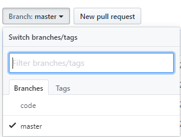
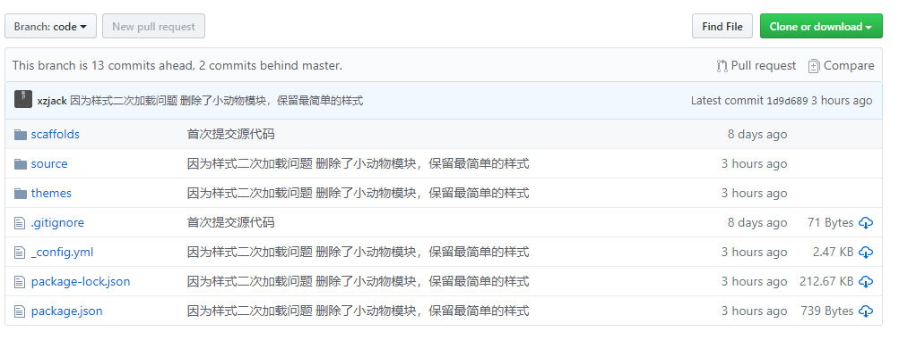
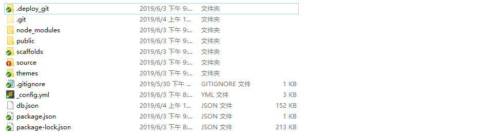

我们知道hexo是一个生成静态网页的博客框架，从_config.yml中可以看到我们`hexo d`操作是将我们的静态文件推送到远程master分支上
```yml
deploy:
  type: git
  repo: git@github.com:xzjack/xzjack.github.io.git
  branch: master
```
那么假如有一天，我们的电脑坏了或者不在身边，那我们要怎么写博客呢？<!--more-->
重新配置环境？显然不可能
所以我们可以将我们的本地源文件利用Git推送到GitHub上进行版本控制
在xzjack.github.io仓库中创建一个分支code:
然后只要执行 git init / git add . / git commit -m "description" 即可创建本地仓库
关联远程仓库`git remote add origin git@github.com:xzjack/xzjack.github.io.git`
之后就可以`git push origin master:code`将本地的配置文件（源文件）推送到远程code分支上了
对比本地文件，我们发现有几个文件夹被忽略了
这些被忽略的文件其实在.gitignore文件中有声明，node_modules文件夹可以通过npm install生成，public与db.json可以通过hexo g生成
但是！！！但是！！！
我们发现theme/next文件夹中竟然没有内容，这是怎么回事呢？原来是next主题文件也是一个git仓库，一个git仓库中不能包含另一个git仓库，否则提交主题文件会失败，所以我么需要将next文件夹中.git*开头的文件统统删除，然后再次push
至此，我们已经实现了源文件的版本控制备份
以后换电脑的时候，只需要安装Node.js与Git就好了，然后执行`$ git clone -b code git@github.com:xzjack/test.git 文件名`，然后再执行`npm install`生成node_modules目录
完！
