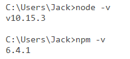
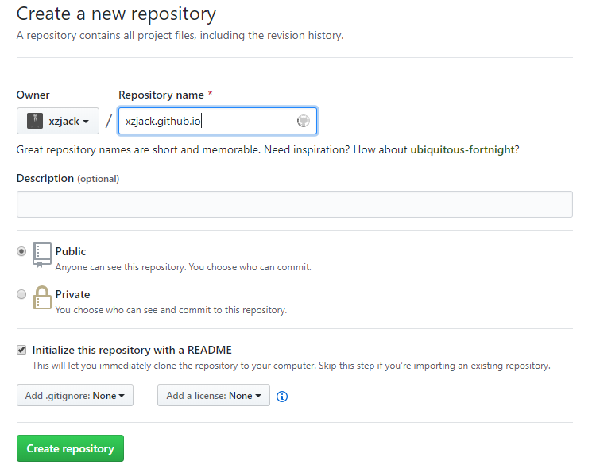
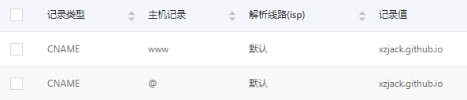
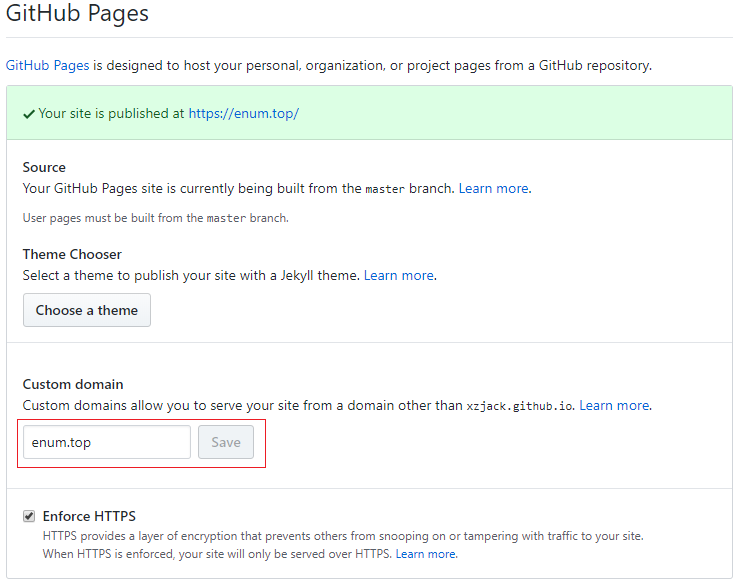
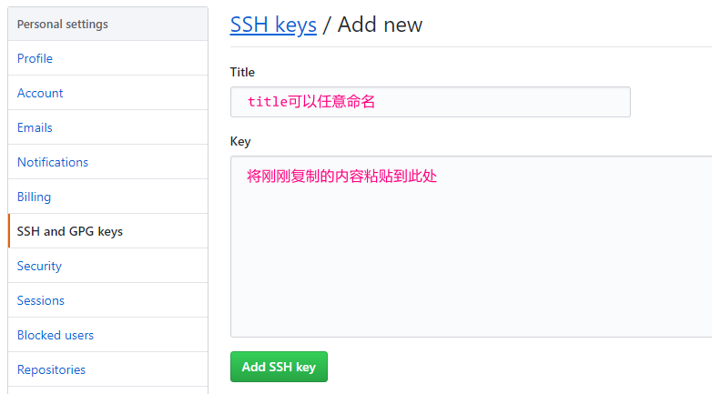
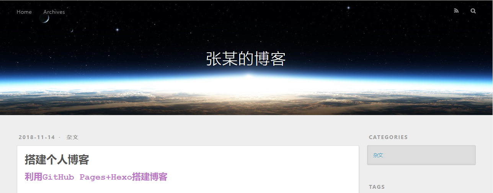


答：利用 GitHub Pages + Hexo 搭建博客

# 前期准备 #
准备环境与工具：Node.js、npm、Git、GitHub账号、域名
<span id="inline-blue">我的环境 </span>
　OS:　win10
　Node.js:　v10.15.3
　npm:　6.4.1
　Git:　2.7.2.windows.1
<!--more-->
**1、安装Node.js**的时候选择 `Add to Path` 安装全部组件
**npm**是Node.js的包管理工具，在安装Node.js的时候顺带装好了
安装完成后可以通过如下方法测试：


**2、创建仓库**
这样就能通过 http://xzjack.github.io 来访问了

**3、绑定域名**
先去注册域名的云服务商那将域名解析，然后去GitHub Pages填写你的域名


**4、配置ssh key**
为何要配置 SSH Key ？利用 Git 从远程仓库 clone 代码的方式有两种，一种是 Https ，另一种是 SSH 。如果使用 Https 方式，不需要任何配置，但是当你 clone 下来后会发现，每次 pull, push 都要输入密码，相当的烦。这样就极大的影响了我们的工作效率。这时候就需要使用 SSH 方式了，使用这种方式就不再需要每次都输入密码这么麻烦了，但是需要配置 SSH Key ，配置方法请看下面。
打开终端，输入以下命令：
`$ cd ~/.ssh`
如果提示：No such file or directory 说明你还没有配置过ssh key
`$ ssh-keygen -t rsa -C "your_email@example.com"`
然后连续3次回车，最终会生成一个文件在用户目录下，打开用户目录，找到 .ssh\id_rsa.pub 文件，记事本打开并复制里面的内容，打开你的github主页，进入个人设置 -> SSH and GPG keys -> New SSH key：
测试是否成功：
`$ ssh -T git@github.com`
此时会提示 Are you sure you want to continue connecting (yes/no)? 　输入yes
过一会儿看到 Hi xzjack! You've successfully authenticated, but GitHub does not provide shell access. 就说明SSH配置成功了
还需要配置如下，这样每次Git提交时，会说明是谁提交了更新
```
$ git config --global user.name "xzjack" // 你的github用户名，非昵称
$ git config --global user.email  "xxx@example.com" // 填写你的github注册邮箱
```
<br>
# 使用Hexo写博客 #
## **Hexo介绍** ##
Hexo是一款基于Node.js的静态博客框架，可以方便的生成静态网页托管在GitHub上，采用插件驱动，可扩展性高
GitHub Pages支持静态页面的解析，而Hexo可以依据配置便捷的生成一套定制式的静态页面，两者一搭配就能开发博客了

<span id="inline-red">**安装前注意事项:**</span>　　
　　１．很多命令可以在cmd下完成，也可以使用git bash来完成，这里统一全部用git bash来执行
　　２．hexo中有两份主要的配置文件，名称都是_config.yml，其中一份位于根目录下，包含Hexo本身配置，一份位于主题目录（themes/xxx）下，由主题作者提供，我们将前者称为**站点配置文件**，后者称为**主题配置文件**
　　３．使用npm安装比较慢，可以更换npm源
　　使用淘宝npm镜像：
　　`npm config set registry https://registry.npm.taobao.org`
　　查看：
　　`npm config get registry`

## **安装** ##
通过npm安装hexo
`$ npm install -g hexo -cli`
接着在电脑创建一个Blog文件夹（名字任取），我的是在 D:\Blog ，此文件夹将用来存放博客的全部内容
```
$ cd d:/Blog
$ hexo init
```
然后`hexo s`开启本地预览，浏览器访问 http://localhost:4000 即可看到效果


## **Hexo常用命令** ##
```
hexo n "文章名称" #新建文章，被放在\source\_posts目录下
hexo n page "页面名称" #新建页面

hexo clean #清除缓存文件 (db.json) 和已生成的静态文件 (public)
hexo g #生成静态页面至public目录
hexo s #开启预览访问 http://localhost:4000 如果访问失败，可能是端口被占用
hexo d #部署到GitHub

hexo g -d #生成并上传
```

## **修改主题** ##
　　默认的主题不好看，我目前使用的这个主题是[NexT](https://github.com/iissnan/hexo-theme-next/blob/master/README.cn.md)，是当前GitHub上star最多的主题，也是个人比较喜欢的主题
1.　安装：
`$ git clone https://github.com/iissnan/hexo-theme-next themes/next //这是5.*版本的安装方式`
2.　去站点配置文件设置主题
`theme: next`
3.　测试
```
hexo clean　//修改主题往往需要先clean一下，否则不生效
hexo s
访问http://localhost:4000
```
4.　将hexo博客部署到GitHub
需要安装`hexo-deployer-git`插件，然后在站点配置文件中配置
`$ npm install hexo-deployer-git --save`
```
deploy:
  type: git
  repo: git@github.com:xzjack/xzjack.github.io.git
  branch: master
```
执行部署指令
`hexo g -d`
完成部署后，可以访问域名测试，如果没有绑定域名则访问 https://xzjack.github.io
<span id="inline-red">**注意:**</span> 假如你用域名访问获取不到页面，而用xxx.github.io访问能获取到页面，那么应该就是执行 hexo d 的时候，把你GitHub Pages中绑定的域名清除了
<span id="inline-green">**怎么办?**</span> 
在你博客的根目录下的source文件夹中创建文件CNAME（无后缀），添加你的域名enum.top
然后在站点配置文件_config.yml中配置如下
```yml
# URL
## If your site is put in a subdirectory, set url as 'http://yoursite.com/child' and root as '/child/'
url: http://enum.top
root: /
permalink: :year/:month/:day/:title/
permalink_defaults:

```
5.　菜单栏配置
我们刚开始默认的菜单只有首页和归档两个，不能够满足我们的要求，所以需要添加菜单，打开 主题配置文件 找到 menu 
```yml
menu:
  home: / || home
  tags: /tags/ || tags
  categories: /categories/ || th
  archives: /archives/ || archive
  about: /about/ || user
  #schedule: /schedule/ || calendar
  #sitemap: /sitemap.xml || sitemap
  #commonweal: /404/ || heartbeat
```
需要哪个菜单就把哪个取消注释就行了
如果事先没有通过 `hexo n page "pageName"` 来创建页面的话，即使在配置文件中取消注释，页面也没法显示
<span id="inline-purple">**举个栗子:**</span>
创建分类页面
`hexo new page categories`
给分类页面添加类型type，找到source/categories文件夹中的index.md文件，打开加上type属性
```
---
title: 分类
date: 2018-11-13 23:40:39
type: "categories"
---
```
这样我们创建的新文章都会自带categories这个属性，我们只需往里填分类，就能自动形成分类了
```
---
title: 搭建个人博客
date: 2018-11-14 17:23:10
categories: hexo
tags: 
　　- hexo
　　- blog
---
```
其他菜单比如标签tags，也是类似的做法...

6.　NexT主题样式设置
```
# Schemes
scheme: Muse
#scheme: Mist
#scheme: Pisces
#scheme: Gemini
```
提供了四种样式，选择自己喜欢的

7.　其他主题插件与配置
其他的还有设置头像啊，添加搜索功能啊，添加评论系统啊等等等等
这里只是简单的讲一下如何搭建博客，那些各种各样的插件与配置自己上网搜去吧

## **一些注意事项** ##
- 在我们配置过程中，一定要仔细，可能一个空格或者一个符号就能使整个博客访问不了
- 在用markdown编辑时，插入本地图片会把图片上传到 https://imgur.com/ [图床](https://baike.baidu.com/item/%E5%9B%BE%E5%BA%8A/10721348?fr=aladdin)，然后提供访问的链接，这样做确实省事，可是万一图床关闭了或是怎么样了，那么博客中的图片就失效了。针对这个问题我们可以这么做：
1.　在站点配置文件_config.yml中`post_asset_folder:`这个选项设为true
2.　在根目录下执行命令`npm install hexo-asset-image --save`，这是安装一个可以上传本地图片的插件
3.　成功后，通过`hexo n "xxx"`来创建文章时，/source/_posts文件夹内除了xxx.md文件还有一个同名的文件夹
4.　我们只要把在xxx.md中需要用到的图片放到同名文件夹中，然后通过``即可插入图片，部署博客到GitHub时，也会把图片上传

> **2019/4/21 下午 10:10:30 更新:** 目前暂时将图片全部移到[七牛云](https://www.qiniu.com/)上了(10G存储空间，10G流量/月)，而且七牛云还提供免费的CDN加速服务(这是我选择七牛云的主要原因)，其他的一些公共免费图床是没有这个快的
如果有一天博客中的图片不能访问了，那么很有可能是欠费了🙄，所以一些重要的图片也需要在本地备份一下
类似的还有阿里云OSS，腾讯云COS，又拍云等等
**2019/4/25:** 好吧，我又把图片放到本地了，原因有二，一是七牛云免费的流量只支持http，这样因为不是全站https都没有🔒的图标了；二是我用着免费的融合CDN测试域名，一个月后就过期了，需要重新迁移到新的域名，这样就得更改所有的图片外链地址，不方便。所以干脆就放本地算了，又不用担心像图床那样挂了也不用担心放在七牛云上超量欠费了，速度慢点就慢点。

- 有时候我们`hexo g -d`提交更改的时候，提示 Could not read from remote repository. 可能的原因是服务器的防火墙限定，或者配置文件限定ip登录，比如你用了VPN
- 在代码块中不能正常使用<>，经过排查发现，是因为安装了hexo-lazyload-image插件的原因，所以有些插件不能随便安装，会带来一些未知的问题
在代码块外，Markdown为了兼容HTML，将尖括号都认为是HTML的语法来处理了，所以碰到`<hello>`形式的都会翻译成`<hello></hello>`，中文的话可以正常显示`<中文>`，为了解决这个问题，可以用转义字符来代替尖括号，左尖括号`&lt;`右尖括号`&gt;` 如：`&lt;display&gt;`翻译成&lt;display&gt;
	

