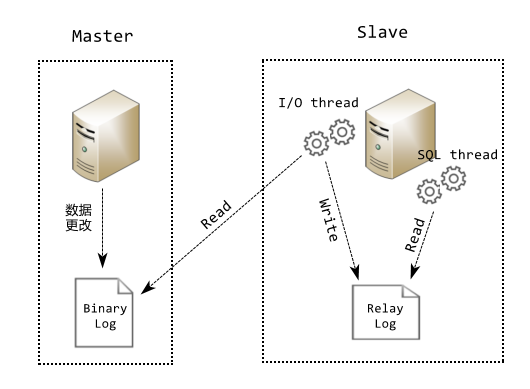
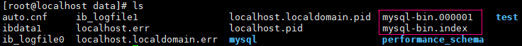
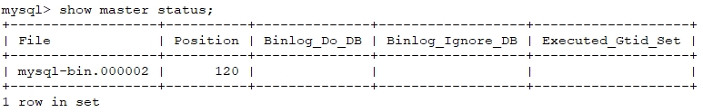
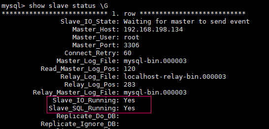
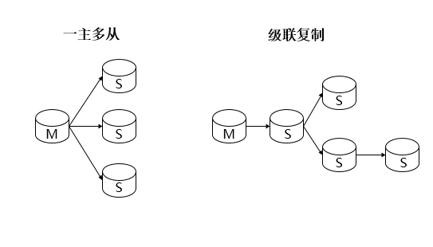
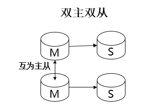
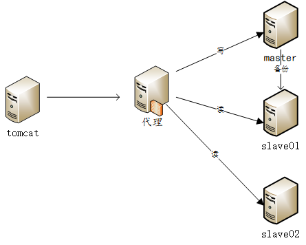

<center>数据库的复制原理图</center><!--more-->步骤:
1. 当主库的数据发生变化时,会将更新的数据写入二进制日志文件中.
2. 从库中的IO线程会试试的监听主库的二进制日志文件.如果文件发生了变化,则获取主库二进制文件中更新的记录.之后写入从库的中继日志中.
3. 当中继日志中有数据时,从库会通过sql线程读取中继日志中的信息,之后将数据进行同步.
4. 当上述的操作完成后,主从同步完成,等待下一次同步.


**开始配置 GO!!!**
1. 修改主库二进制文件配置
vim /etc/my.cnf
```
[mysqld]
...
server-id=1
log-bin=mysql-bin
```
2. 之后重启：service mysql restart
cd /usr/local/src/mysql/data 进入mysql安装目录查看（我这里是data文件夹）
mysql服务重启一下就会多一个mysql-bin.00000x文件

3. 同理，编辑从库配置，设置server-id=2，其余操作一致

4. 实现数据库主从挂载
检查主库状态
切换到从库，执行挂载指令：
```
change master to master_host="192.168.198.134", master_port=3306, master_user="root", master_password="root", master_log_file="mysql-bin.000002", master_log_pos=120;
```
	开启主从服务：
start slave;
检查主从状态：
show slave status \G     # 在Navicat中\G不起作用
这两个都是Yes，说明OK，如果不是那么可能是网络，用户名密码或者pos 的问题，网络只要能ping通应该就OK，pos是show master status的Position的值。这里我一开始配的时候，Slave_IO_Running是No，原因是mysql有个uuid，这是唯一标识，而我的从机是克隆过来的，导致了uuid一样了，所以只要修改一下uuid就行了（uuid在auto.cnf文件中），修改完了重启一下mysql服务

	主从同步搭建完成，可以测试一下

	拓展阅读：[与MySQL传统复制相比，GTID有哪些独特的复制姿势?](https://dbaplus.cn/news-11-857-1.html)

**上文我们实现了一主一从的同步备份，当然也可以实现一主多从，或者级联复制**
一主多从的配置就不讲了，照着上文配就行了，级联复制自己Google
***
**这里我们还要考虑主库宕机了，怎么办？**
两种解决方案：
1. 双主模式
- 假如原先是一主一从的配置，那么直接互为主从，实现双机热备
- 假如原先是一主两从或者三从的配置，那么可以设计成双主双从架构
设置好双主双从复制后：
&emsp;&emsp;一个主出现问题，可以切换到另外的主进行写数据，新主同步数据给它的从；
&emsp;&emsp;待问题旧主恢复服务后，新的主会同步数据给它，它再同步数据给自己的从，这样不会出现数据的不同步和服务的不可用。
参考文章：https://www.cnblogs.com/liudongdong666666/p/7818240.html
2. 主从故障切换
http://www.voidcn.com/article/p-supxiiit-rv.html

***
好了，实现了主从同步备份
接着需要做什么呢？我们是不是可以把从数据库利用起来，只是用来备份是不是太浪费了？
这就有了**读写分离，主数据库写，从数据库读**，从数据库只能读不能写，不然数据不一致，或者主键冲突直接报错

实现：用代理服务器分发请求，然后从数据库可能有多台，这就可以使用负载均衡


[Mycat中间件介绍](http://www.mycat.io/)

Mycat使用（这里我们主要基于双机热备来进行读写分离的配置）
1. 上传文件，解压就行了
2. 编辑server.xml文件 「/usr/local/src/mycat/conf」
```
<user name="root">
    <property name="password">root</property>
    <!-- 与schema.xml中的配置相同 注意数据库的大小写 -->
    <property name="schemas">TESTDB</property>
</user>
<!-- 以下配置没用的吧，有上面的就够了 -->
<user name="user">
    <property name="password">user</property>
    <property name="schemas">TESTDB</property>
    <property name="readOnly">true</property>
</user>
```
3. 编辑schema.xml文件
```
<?xml version="1.0"?>
<!DOCTYPE mycat:schema SYSTEM "schema.dtd">
<mycat:schema xmlns:mycat="http://io.mycat/">
  
   <!--name属性是自定义的  dataNode表示数据库的节点信息-->
   <schema name="TESTDB" checkSQLschema="false" sqlMaxLimit="100" dataNode="dn1"/>
   <!--定义节点名称/节点主机/数据名称-->
   <dataNode name="dn1" dataHost="localhost1" database="dbname" />
      <!--参数介绍-->
      <!--balance="0"表示所有的读操作都会发往writeHost主机，相当于不开启读写分离机制了 -->
      <!--balance="1"表示全部的 readHost 与 stand by writeHost 参与 select 语句的负载均衡-->
	  <!--balance="2"表示所有读操作都随机的在 writeHost、readhost 上分发-->
	  <!--balance="3"，所有读请求随机的分发到 wiriterHost 对应的 readhost 执行，writerHost 不负担读压力，注意 balance=3 只在 1.4 及其以后版本有，1.3 没有-->
      <!--writeType=0 所有的写操作都发往第一个writeHost主机-->
      <!--writeType=1 所有的写操作随机发往writeHost中-->
      <!--dbType 表示数据库类型 mysql/oracle-->
      <!--dbDriver="native"  固定参数 不变-->
      <!--switchType=-1 表示不自动切换, 主机宕机后不会自动切换从节点-->
      <!--switchType=1  表示会自动切换(默认值)如果第一个主节点宕机后,Mycat会进行3次心跳检测,如果3次都没有响应,则会自动切换到第二个主节点-->
      <!--并且会更新/conf/dnindex.properties文件的主节点信息 localhost1=0 表示第一个节点.该文件不要随意修改否则会出现大问题-->
   <dataHost name="localhost1" maxCon="1000" minCon="10" balance="1"
           writeType="0" dbType="mysql" dbDriver="native" switchType="1"  slaveThreshold="100">
      <heartbeat>select user()</heartbeat>
      <!--配置第一台主机主要进行写库操作,在默认的条件下Mycat主要操作第一台主机在第一台主机中已经实现了读写分离.如果从节点比较忙,则主节点分担部分压力.-->
      <writeHost host="hostM1" url="192.168.198.134:3306" user="root" password="root">
         <!--读数据库，可以配置多个-->
         <readHost host="hostS1" url="192.168.198.135:3306" user="root" password="root" />   
      </writeHost>
         <!--定义第二台主机 由于数据库内部已经实现了双机热备.-->
         <!--Mycat实现高可用.当第一个主机134宕机后.mycat会自动发出心跳检测.检测3次.-->
         <!--如果主机134没有给Mycat响应则判断主机死亡.则回启东第二台主机继续为用户提供服务.-->
         <!--如果134主机恢复之后则处于等待状态.如果135宕机则134再次持续为用户提供服务.-->
         <!--前提:实现双机热备.-->
     
      <writeHost host="hostM2" url="192.168.198.135:3306" user="root" password="root">
         <readHost host="hostS1" url="192.168.198.134:3306" user="root" password="root" />
      </writeHost>
   </dataHost>
</mycat:schema>
```
4. mycat启动测试
```
./mycat { console | start | stop | restart | status | dump }

./mycat console 打印控制台信息
        start   启动mycat
        ...
```

	假如mycat报错了，可以去/usr/local/src/mycat/logs 目录下查看日志信息
5. mycat默认端口号是8066，需要注意端口占用问题。以后数据库url连接mycat就可以了


