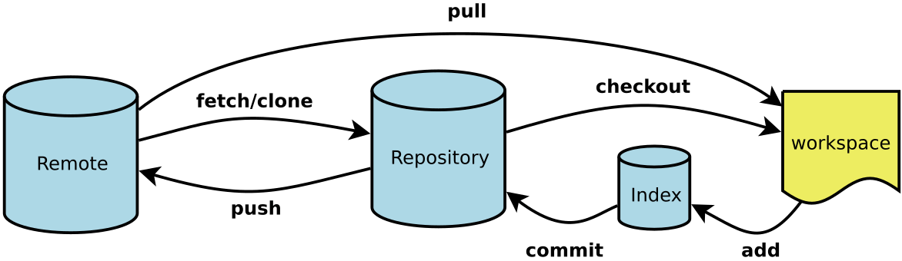

## 安装 ##
Linux 
Redhat系列： 
`$ sudo yum install git`
Debian系列：
`$ sudo apt-get install git`

Windows
https://git-scm.com/download/win

安装完后右键就能使用Git Bash了，可以`git version`查看版本
<!--more-->
## 用户信息配置 ##
```
$ git config --global user.name "xzjack" 
$ git config --global user.email zjie1one@gmail.com
```

## 使用 ##

**初始化一个Git仓库**
`$ git init`
**添加文件到暂存区**
`$ git add <file>`
**添加到版本库**
`$ git commit -m "description"`
**查看工作区状态**
`$ git status`
**查看修改后的差异**
```
$ git diff # 不加参数即默认比较工作区与暂存区
$ git diff <branch1> # 在master分支下执行，就代表比较master分支与branch1分支的差异
```
详见：https://www.cnblogs.com/qianqiannian/p/6010219.html
**查看提交日志**
`$ git log`
**丢弃工作区的修改**
`$ git checkout -- <file>`
**丢弃暂存区的修改**
```
分两步：
第一步：把暂存区的修改撤销，重新放回工作区
$ git reset HEAD <file> 
第二步：撤销工作区的修改
$ git checkout -- <file>
```
**版本回退**：假如已经提交到版本库了，但是没提交到远程库
`$ git reset --hard HEAD^`
以上命令是返回上一个版本，在Git中，用HEAD表示当前版本，上一个版本就是HEAD^，上上一个版本是HEAD^^，往上100个版本写成HEAD~100。
回退指定版本号：
`$ git reset --hard commit_id`